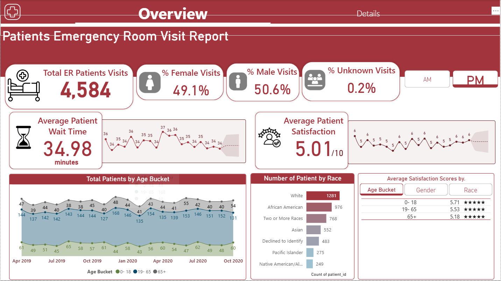
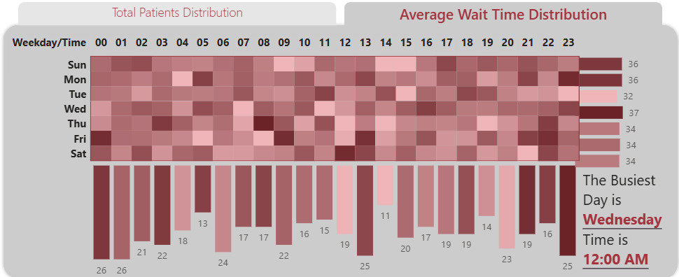
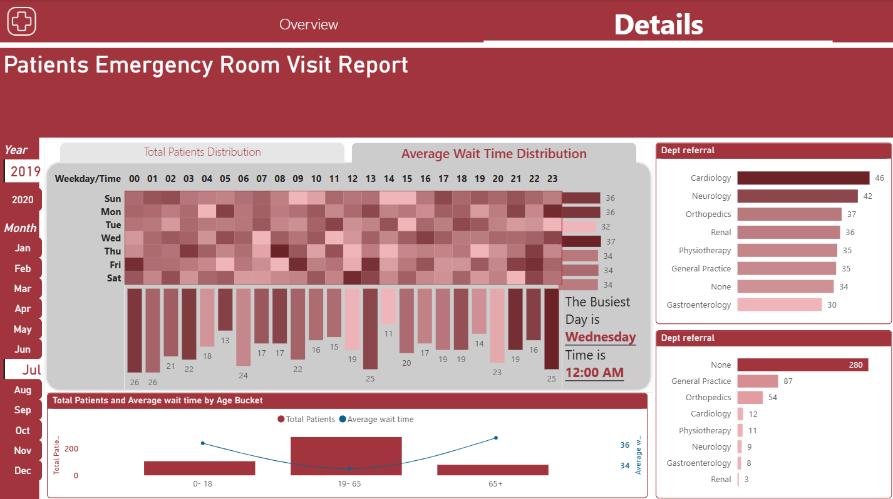
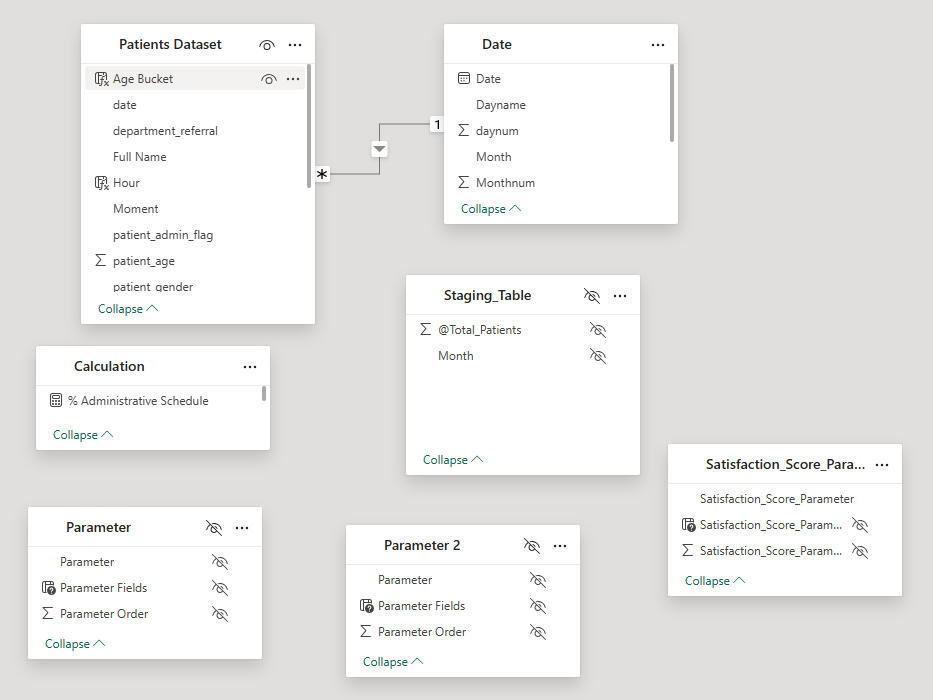

# EmergencyRoom-Healthcare-Analytics

A Power BI dashboard analyzing emergency room performance: patient volumes, wait times, satisfaction scores, and departmental trends, with interactive navigation via bookmarks and field parameters.

## 🚩 Problem Statement  
Identify busiest days/times, average wait times, satisfaction patterns across demographics, and trends in ER visits to optimize operations.

## 📊 Dashboard Previews  

### Overview  
The Overview page displays total ER patient visits, gender distribution, and average wait times with trend lines.  
 

### Wait Times Heat Map  
A heat map showing average wait time by hour of day (x-axis) and weekday (y-axis), highlighting peak congestion periods.  
 

### Details  
The Details page features bar charts of department referrals, patient age buckets, and average satisfaction scores by demographic.  
 

## 📦 Data Model  
The data model integrates fact and lookup tables to support dynamic analysis and navigation.

 

**Core Tables & Relationships**  
- **Patients Dataset**: Fact table of all patient visits (date, demographic, wait time, satisfaction, department_referral)  
- **Date**: Standard date dimension (Date, Day, Month, Year, Hour)
- **Parameter**, **Parameter 2**, **Satisfaction_Score_Parameter**: Field parameter tables enabling dynamic slicers for time granularity, department focus, and satisfaction metrics  

**Relationships**  
- HospitalER[date] → Date[Date]

## 🎛️ Field Parameters  
Field parameters allow report users to toggle which fields or measures appear in visuals. The **Satisfaction_Score_Parameter** table provides selectable satisfaction metrics by age, gender, or race. For full details on creating and using field parameters in Power BI, see the official documentation:  
https://learn.microsoft.com/en-us/power-bi/create-reports/power-bi-field-parameters [8]

## 📦 Data Source  
- **Hospital-ER.csv** (in `Dataset/`):  
  - `date` (DateTime)  
  - `patient_id`  
  - `patient_gender`  
  - `patient_age`  
  - `patient_race`  
  - `patient_waittime` (minutes)  
  - `patient_sat_score` (1–10)  
  - `department_referral`  

## 🎯 KPIs & Measures  
- Total ER Visits  
- Busiest Day & Hour  
- Average Wait Time (overall, by department, by demographic)  
- Patient Satisfaction Score (by age, gender, race)  
- Monthly and Hourly Visit Trends  

## ✨ Dashboard Features  

### Bookmarks & Navigation  
- **Home**: Overview  
- **Trends**: Time-series charts  
- **Heat Map**: Wait time heat map  
- **Satisfaction**: Satisfaction by demographic  
- **Details**: Department and age bucket analysis  

### Heat Map  
- **X-axis**: Hour of day  
- **Y-axis**: Weekday  
- **Color**: Avg wait time (darker = longer)  

### Department Bar Charts  
- Compare avg wait time by department (sorted descending)  
- Identify bottlenecks (e.g., Neurology highest wait time)  

### Satisfaction Charts  
- Line and bar charts showing satisfaction over time by selected demographic (via field parameter)  

## 🛠️ Tech Stack  
- **Power BI Desktop** for report development  
- **DAX** for measures and field parameter logic  
- **CSV** raw data in `Dataset/`  

## 🚀 How to Use  
1. Clone repository  
2. Place `Hospital-ER.csv` in `Dataset/`  
3. Open `PBIX/ER_Performance.pbix` in Power BI Desktop  
4. Enable **Field Parameters** under File > Options and settings > Options > Preview features (if not enabled)
5. Refresh data  

## 📜 License  
MIT License. See [LICENSE](LICENSE) for details.  
